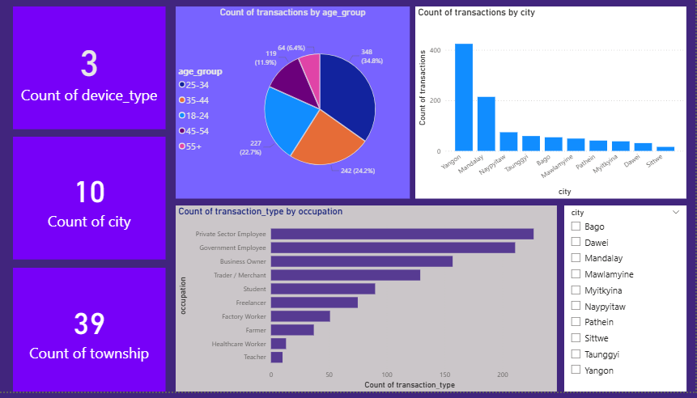
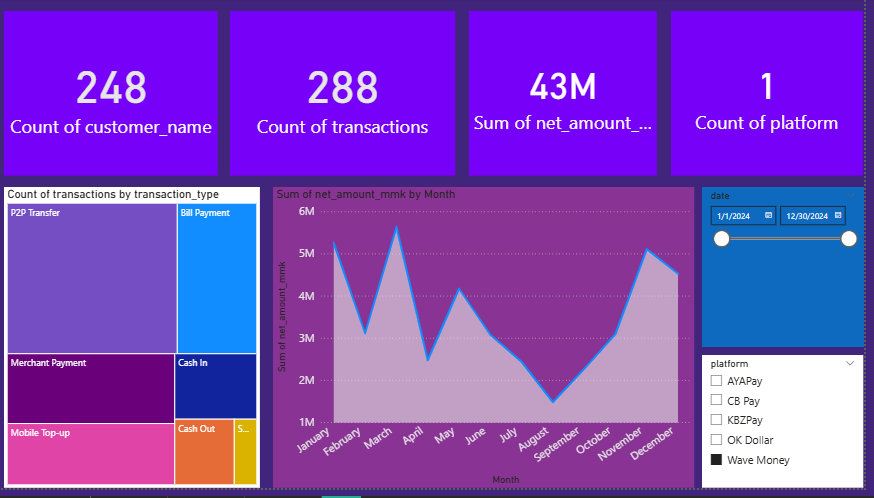
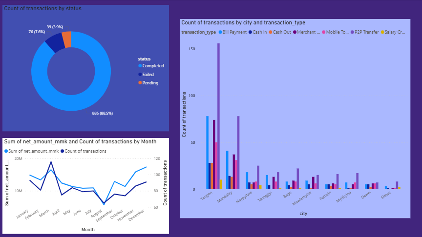

# Myanmar Mobile Money Transaction Analysis
> **Data Analyst Portfolio Project** — End-to-end analysis of Myanmar mobile money transactions covering synthetic data generation, exploratory data analysis, Power BI interactive dashboard, and formal PDF reporting.

---

## Dashboard Preview

> Open `finalReport_mobile_transactions.pbix` in Power BI Desktop to explore the full interactive dashboard with slicers.

**How to add your screenshots:**
1. Open the `.pbix` → press `Windows + Shift + S` → snip each page
2. Save to `assets/page1.png`, `assets/page2.png`, `assets/page3.png`
3. Then add below:

```markdown



```

---

## Project Structure

```
myanmar-mobile-money-analysis/
├── data/
│   ├── raw/
│   │   └── myanmar_mobile_money_dirty.csv        # Generated dirty dataset (1,010 rows)
│   └── cleaned/
│       └── myanmar_mobile_money_clean.csv         # Cleaned dataset ready for analysis
├── notebooks/
│   └── 01_data_generation_and_cleaning.ipynb     # Python EDA + cleaning notebook
├── scripts/
│   ├── generate_myanmar_transactions.py           # Faker data generator
│   └── build_report.py                            # PDF report generator
├── dashboard/
│   └── finalReport_mobile_transactions.pbix       # Power BI interactive dashboard
├── report/
│   └── Myanmar_MobileMoney_Analytics_Report.pdf  # Final 10-page PDF report
├── assets/
│   └── (dashboard screenshots)
├── requirements.txt
└── README.md
```

---

## Business Problem

Myanmar's mobile money market has grown rapidly with Wave Money, KBZPay, AYAPay, CB Pay, and OK Dollar competing for dominance. This project simulates a realistic transaction dataset and answers:

- Which platform has the highest market share?
- Which cities are underserved by mobile money infrastructure?
- What is the transaction failure rate and where is friction highest?
- Which customer segments drive the most volume?
- What seasonal patterns exist in monthly transaction revenue?

---

## Key Findings

| # | Finding | Impact |
|---|---------|--------|
| 1 | **Wave Money leads** with 29.9% market share (302 transactions) | Dominant but not monopolistic |
| 2 | **Yangon drives 40.4%** of all transactions | Geographic concentration risk |
| 3 | **August spike +37.4% MoM** (105.4M MMK peak) | Seasonal demand opportunity |
| 4 | **P2P Transfer = 35.0%** of all transaction types | Remittance is the core use case |
| 5 | **8.0% failure rate** = 81 failed transactions | UX friction to investigate |
| 6 | **Salary Credit only 2.0%** (20 transactions) | Major untapped growth opportunity |

---

## Data Generation

Synthetic dataset generated using Python Faker with Myanmar-specific customisation:

```python
pip install faker pandas numpy

# Generate 1,000 clean rows
python scripts/generate_myanmar_transactions.py --rows 1000

# Generate dirty rows (for cleaning practice)
python scripts/generate_myanmar_transactions.py --rows 1000 --dirty
```

**What makes it realistic:**
- Myanmar names from actual name pools (`Aung Htun`, `Ei Naing`, `Thida Win`)
- Correct phone formats (`09XXXXXXXXX` with real operator prefixes)
- Log-normal amount distribution (small transactions more common than large)
- All amounts rounded to nearest 500 MMK (Myanmar standard)
- Weighted city distribution (Yangon 40%, Mandalay 20%, others proportional)

---

## Data Cleaning Summary

| Issue | Affected | Fix applied |
|-------|:--------:|-------------|
| Exact duplicate rows | 10 | `drop_duplicates(keep='first')` |
| Malformed phone numbers | ~30 | Custom `clean_phone()` function |
| Mixed date formats | ~20 | `pd.to_datetime(infer_datetime_format=True)` |
| Lowercase platform names | ~20 | `.replace()` mapping dict |
| Missing values | ~30 | Filled with `'Unknown'` |

**Result: 1,010 raw rows → 1,000 clean rows · 0 remaining issues**

---

## Dashboard Overview

Built in **Power BI Desktop 2025.08** · 3 pages · 18 visuals · 3 interactive slicers

| Page | Slicer | Content |
|------|--------|---------|
| Page 1 — Demographics | City | Age group pie, Occupation bar, City column |
| Page 2 — Transactions | Date, Platform | Monthly area chart, Treemap, Volume KPIs |
| Page 3 — Geography | — | Status donut, City × Type stacked bar, Line chart |

**Chart types used:** Card · Pie · Column · Bar · Area · Treemap · Donut · Line (8 types)

---

## Tech Stack

| Layer | Tool | Purpose |
|-------|------|---------|
| Data generation | Python · Faker · NumPy | Synthetic Myanmar transaction data |
| Data cleaning | Python · Pandas | Fix data quality issues |
| Visualisation | Power BI Desktop | Interactive 3-page dashboard |
| Reporting | Python · Matplotlib · ReportLab | 10-page formal PDF report |
| Version control | Git · GitHub | Project sharing |

---

## How to Run

```bash
# 1. Clone
git clone https://github.com/YOUR_USERNAME/myanmar-mobile-money-analysis.git
cd myanmar-mobile-money-analysis

# 2. Install
pip install -r requirements.txt

# 3. Generate data
python scripts/generate_myanmar_transactions.py --rows 1000 --dirty

# 4. Open dashboard
# Open dashboard/finalReport_mobile_transactions.pbix in Power BI Desktop

# 5. View report
# Open report/Myanmar_MobileMoney_Analytics_Report.pdf
```

---

## Dataset Columns (21 total)

| Column | Type | Description |
|--------|------|-------------|
| `transaction_id` | string | Unique ID `TXN-XXXX-XXXXXXXX` |
| `timestamp` | datetime | Full `YYYY-MM-DD HH:MM:SS` |
| `month` | string | `YYYY-MM` for monthly grouping |
| `hour` | int | Hour of day (0–23) |
| `customer_name` | string | Synthetic Myanmar name |
| `age_group` | string | 18-24, 25-34, 35-44, 45-54, 55+ |
| `occupation` | string | 10 occupational categories |
| `phone_number` | string | Myanmar format `09XXXXXXXXX` |
| `city` | string | One of 10 Myanmar cities |
| `platform` | string | Wave Money / KBZPay / AYAPay / CB Pay / OK Dollar |
| `transaction_type` | string | P2P, Bill Payment, Top-up, Merchant, Cash In/Out, Salary |
| `amount_mmk` | int | Gross transaction amount (MMK) |
| `fee_mmk` | int | Platform fee — 0 for most types |
| `net_amount_mmk` | int | Amount after fees |
| `status` | string | Completed / Failed / Pending |
| `description` | string | Human-readable description |

---

## Recommendations

1. **Replicate the August demand spike** — identify what drove +37.4% MoM and engineer it in Q4. Even half adds ~50M MMK.

2. **Expand outside Yangon** — 8 cities show organic adoption without investment. Agent network expansion in Pathein, Taunggyi, and Bago could unlock significant new volume.

3. **Target employer salary disbursement** — Salary Credit is the least-used type at 2.0%. Partnering with Yangon private sector employers would dramatically increase platform stickiness.

4. **Reduce the 8% failure rate** — a root-cause audit by platform, city, and transaction type would identify the highest-priority technical fix.

---

## PDF Report Contents (10 pages)

| Page | Content |
|------|---------|
| 1 | Cover — title, metadata, table of contents |
| 2 | Executive summary + 4 KPI cards |
| 3 | Customer demographics — age + occupation charts |
| 4 | Monthly revenue trend — line chart + MoM table |
| 5 | Platform analysis — market share breakdown |
| 6 | City geographic breakdown |
| 7 | Transaction type analysis |
| 8 | Order status & fulfilment quality |
| 9 | Dashboard technical overview |
| 10 | 4 prioritised business recommendations |

---

## Author

**[Your Name]** · Junior Data Analyst · Myanmar

- Email: your.email@gmail.com
- LinkedIn: [linkedin.com/in/yourprofile](https://linkedin.com/in/yourprofile)
- GitHub: [github.com/YOUR_USERNAME](https://github.com/YOUR_USERNAME)

---

*Built with Python · Power BI · ReportLab · from Myanmar*
"# Mobile_Sale_Analysis_Dashboard" 
